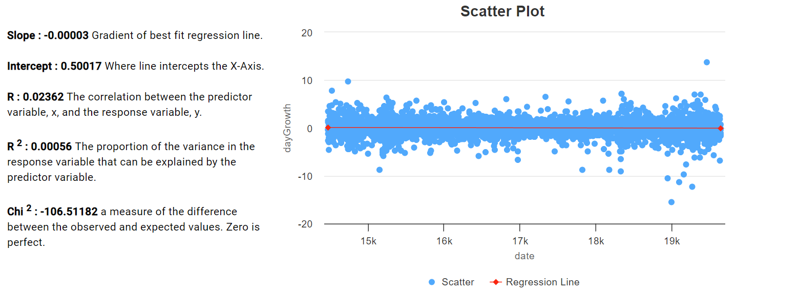

# 2.2.10 Cycle 10 - Adding Auto-analysis Feature

## Design

In this next cycle of my project, I'm introducing a new addition: the "Auto-Analysis" feature. This feature is designed to make it incredibly easy for users to discover which parameters have the most significant correlation with stock market growth.

Here's how it works:

1. **Correlation Calculation**: The Auto-Analysis feature goes through all the available parameters and calculates how each one is correlated with stock market growth. In simpler terms, it checks to see how closely each parameter moves in sync with the stock market's ups and downs.
2. **Ordering Parameters**: Once all the correlations are calculated, the feature organizes these parameters in a specific order. It places the parameter with the strongest correlation right at the top of the list. In other words, it's like arranging a group of friends by height, but here we're arranging parameters by how well they predict stock market growth.
3. **User-Friendly Display**: To make this information accessible and clear, I've dedicated a separate tab on my website for this Auto-Analysis feature. When users click on this tab, they'll see a table. In this table, the parameter with the highest correlation is at the very top. The table then lists other parameters in order of their correlation strength.

### Objectives

* [x] Calculate regression values for a number of different parameters.
* [x] Show results sorted by r2 in a material design table.
* [ ] Calculate forecast stock price.
* [ ] Show forecast.

####

## Outcomes

**Calculate regression values for a number of different parameters.**

First, I started by adding all the different parameters that I've allowed users to find correlations with and I've added them all to an array, inside this array I've used the function "doRegression" to perform regression analysis on these parameters to find different information like the "slope", "gradient" and most importantly r^2. I then at the bottom of this screenshot added a comparator function which I used to sort the array. This will display in the auto-analysis section an ordered list going from the parameter with the highest correlation with growth to the lowest.

<figure><figcaption></figcaption></figure>

**Show results sorted by r2 in a material design table.**

I copied the html table definition from the history component and modified it to display the fields returned by the "doRegression" function. one issue i had was date formats as i found it hard to get them in British format.

<figure><figcaption></figcaption></figure>

#### Calculate forecast stock price.

To do this I changed the doRegression function to calculate a forecast for each regression it was running and return them to the calling function. I used the line of best fit calculated by the linear regression routine to calculate the forecast.

<figure><figcaption></figcaption></figure>

#### Show forecast

<figure><figcaption>
HTML code for autoanalysis section
</figcaption></figure>

<figure><figcaption>
Screenshot of auto analysis section
</figcaption></figure>

<figure><figcaption>
Code for forecast
</figcaption></figure>

## Testing

### Tests

<table><thead><tr><th width="85">Tests</th><th width="167">Instructions</th><th width="355">What I expect</th><th width="209">What actually happens</th><th>Pass/Fail</th></tr></thead><tbody><tr><td>1</td><td>Click "calculate" button</td><td>A table to pop up with data to do with all parameters, an explanation of what parameter has highest correlation and a forecast.</td><td>A table popped up with data to do with all parameters and an explanation of which parameter has the highest correlation and data on future forecast.</td><td>Pass</td></tr><tr><td>2</td><td>Check if all linear regression data point are calculated correctly</td><td>All the numbers to follow the correct formula and end up being accurate</td><td>Some numbers dont follow the correct formula and end up being incorrect</td><td>Fail</td></tr><tr><td>3</td><td>Make sure the parameter titled "best correlation" is acctualy the best correlation</td><td>The parameter with the highest r^2 value to be displayed</td><td>The parameter with the higheset r^2 value is displayed</td><td>pass</td></tr><tr><td>4</td><td>Check if closing price value is accurate</td><td>Type up your given stock on google and check that the closing price displayed online is the same as the one that is presented on my website</td><td>Closing price is accurate</td><td>pass</td></tr></tbody></table>

### Evidence

