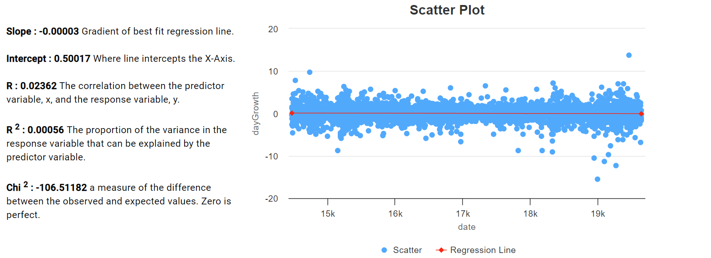

# 2.2.9 Cycle 9 - Backend Server

## Design

One of the main problems with the work we have done so far is that the calls to EOD are all done from the frontend Javascripts. This is bad as it means that its very easy for someone to find our API-Key, they could then use it to rack up huge costs by using it themselves. What I need to do to stop this is create my own back-end and call it from the front end any time I need to get data from EOD. The back-end would securely hold the API Key and use it to answer requests from the front-end when calling EOD.&#x20;

The back-end server technology that goes well with Angular is Node/express.

As I've never written a back-end before I will take a Node/Express template back-end server and modify it for what I want to do.

### Objectives

* [x] Implement basic Node/Express back-end server.
* [x] Create API's for all the calls to EOD API's in the front-end.
  * [ ] exchange-list
  * [ ] fundamentals
  * [ ] insider-transactions
  * [ ] eod&#x20;
  * [ ] exchange-symbol-list
  * [ ] sentiments
* [x] Update frontend to (optionally) use Backend Server.

### Outcomes

###

#### Create template backend server:

Using the express / node tutorial at [https://code.visualstudio.com/docs/nodejs/nodejs-tutorial](https://code.visualstudio.com/docs/nodejs/nodejs-tutorial). I created a sample server with a defined API. I then modified that to implement my own API. with the following api routes:

* fundamentals:code     = Get fundamental data for a specific stock.
* exchange-list     =  Get the list of supported exchanges.
* eod  = Get the history of end-of-day prices for a stock.  &#x20;
* insider-transactions = Get the list of insider transactions for a specific stock.
* sentiments = Get sentiment data for a stock.
* exchange-symbol-list = Get stock symbol list for a specific exchange.

Each router is set up using a very similar code. which calls the actual routine that communicates with EOD and then passes back the result through the API.

<figure><figcaption></figcaption></figure>

#### Implement the 6 required EOD API's

Now I have the router I need to build the part that will call EOD. This is basically a copy/paste of the code I had in the front end. For instance, the .getStockList(exchange) function above looks like:

<figure><figcaption>
getStockList function.
</figcaption></figure>

* You can see that I put together the API call URL and then execute passing the results back to the calling routine.
*
*
